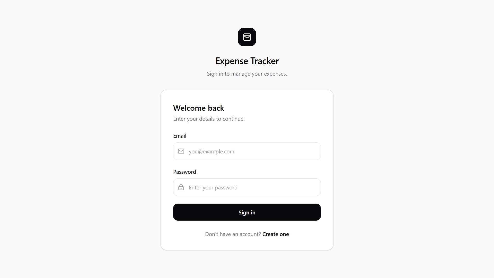
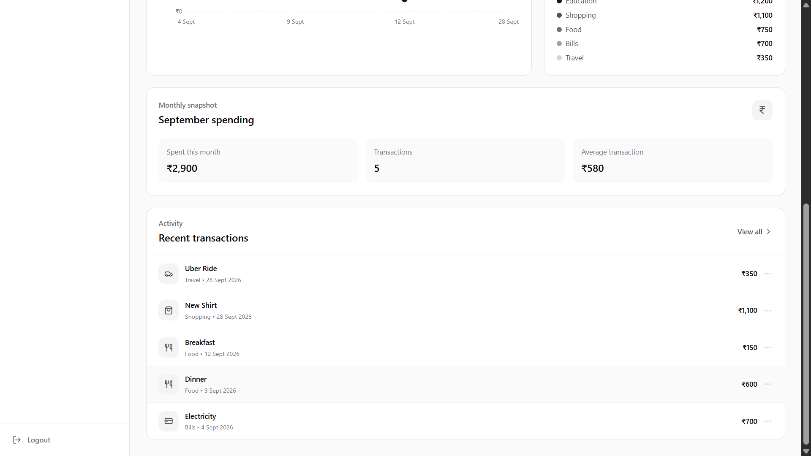
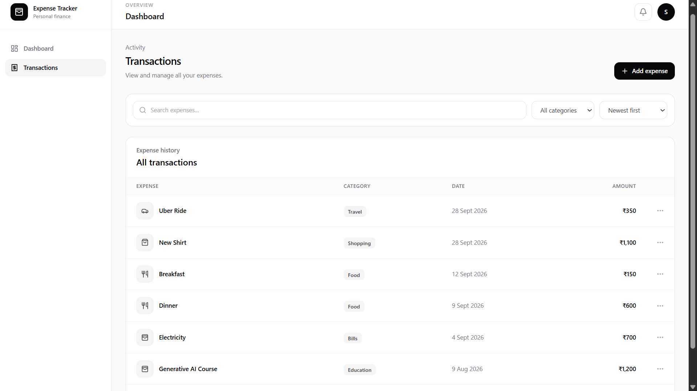
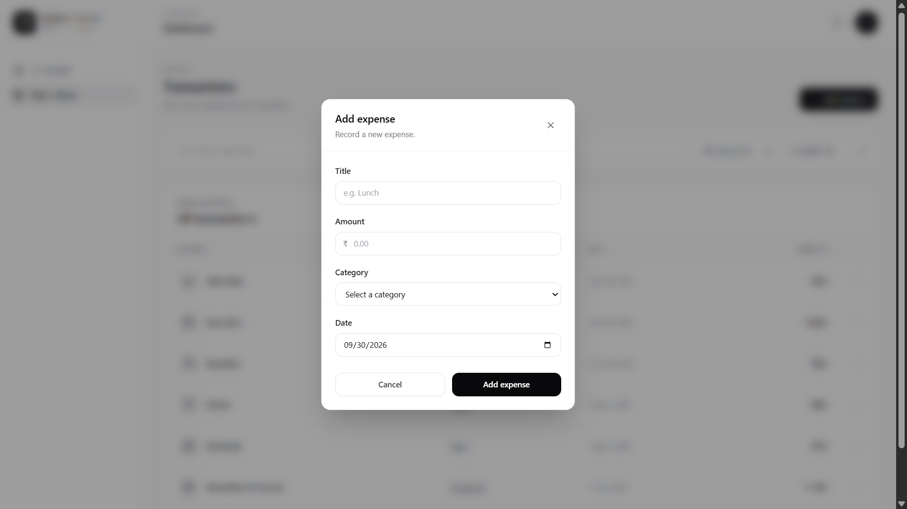
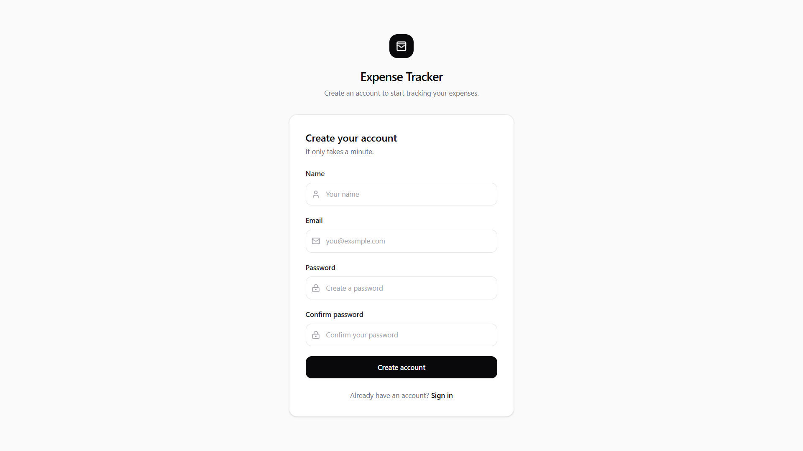

# Expense Tracker — Frontend

A modern React frontend for a full-stack personal expense tracking application.

The application lets users securely manage expenses, view spending analytics, and understand their spending through a clean dashboard.

## Live Demo

**Frontend:**  
https://expense-tracker-frontend-rho-lake.vercel.app/

**Backend API:**  
https://expense-tracker-api-njyi.onrender.com/api

> The frontend is deployed on Vercel and communicates with the Express backend deployed on Render.

---

## Screenshots

### Login



### Registration


### Dashboard



### Dashboard — Spending Details



### Transactions



### Add Expense



---

## Features

### Authentication
- User registration
- User login
- JWT-based authentication
- Protected application routes
- Persistent authentication state

### Dashboard
- Total spending
- Current-month spending
- Total expense count
- Monthly expense count
- Spending trend chart
- Category-wise spending breakdown
- Recent transactions
- Monthly spending snapshot
- Average transaction amount
- Quick Add Expense action

### Transactions
- View all expenses
- Search expenses
- Filter by category
- Sort transactions
- Add expenses
- Edit expenses
- Delete expenses
- Pagination

### User Experience
- Clean and minimal interface
- Responsive layout
- Reusable React components
- Loading states
- Empty states
- Error handling
- Accessible form controls

---

## Tech Stack

| Technology | Purpose |
|---|---|
| React | UI development |
| Vite | Frontend tooling and build |
| Tailwind CSS | Styling |
| React Router | Client-side routing |
| Axios | API communication |
| Recharts | Data visualization |
| JavaScript | Application logic |

---

## Application Architecture

```text
User
 │
 ▼
React + Vite Frontend
 │
 │ Axios / REST API
 ▼
Express.js Backend
 │
 ▼
MongoDB
```

### Production Deployment

```text
┌──────────────────────────┐
│          Vercel          │
│   React Frontend         │
└────────────┬─────────────┘
             │
             │ HTTPS / REST API
             ▼
┌──────────────────────────┐
│         Render           │
│   Express Backend API    │
└────────────┬─────────────┘
             │
             ▼
┌──────────────────────────┐
│         MongoDB          │
│        Database          │
└──────────────────────────┘
```

---

## Project Structure

```text
expense-tracker-frontend/
│
├── public/
├── screenshots/
│   ├── login.png
│   ├── register.png
│   ├── dashboard.png
│   ├── dashboard-details.png
│   ├── transactions.png
│   └── add-expense.png
│
├── src/
│   ├── components/
│   ├── pages/
│   ├── services/
│   ├── lib/
│   └── ...
│
├── .gitignore
├── package.json
├── vite.config.js
└── README.md
```

---

## API Integration

The frontend communicates with the backend through Axios.

The production API URL is configured using:

```env
VITE_API_URL=https://expense-tracker-api-njyi.onrender.com/api
```

For local development:

```env
VITE_API_URL=http://localhost:5000/api
```

Authentication tokens are included with protected API requests.

---

## Local Development

### 1. Clone the repository

```bash
git clone <your-github-repository-url>
cd expense-tracker-frontend
```

### 2. Install dependencies

```bash
npm install
```

### 3. Configure environment variables

Create a `.env` file:

```env
VITE_API_URL=http://localhost:5000/api
```

Make sure the backend API is running locally.

### 4. Start the development server

```bash
npm run dev
```

Vite will display the local development URL in the terminal.

### 5. Build for production

```bash
npm run build
```

---

## Deployment

The frontend is deployed using **Vercel**.

Production environment variable:

```env
VITE_API_URL=https://expense-tracker-api-njyi.onrender.com/api
```

The backend is deployed separately on Render.

---

## Expense Categories

The application supports:

- Food
- Travel
- Shopping
- Bills
- Health
- Education
- Entertainment
- Other

---

## What I Practiced

Building this frontend involved practical experience with:

- React application architecture
- Component-based UI development
- React Router
- Protected routes
- Form handling
- API integration with Axios
- Authentication state management
- REST API consumption
- Dashboard data visualization
- Recharts
- Responsive UI design
- Error and loading states
- Environment variables
- Production builds
- Vercel deployment
- Debugging frontend/backend integration

---

## Project Status

**Completed and deployed.**

The frontend is connected to the production backend and the core authentication, dashboard, transaction management, and expense workflows have been tested.

---

## Future Improvements

Potential future additions:

- Budget management
- Budget alerts
- Recurring expenses
- Income tracking
- Date-range analytics
- CSV/PDF export
- Advanced financial reports
- Dark mode
- Mobile-focused enhancements
- Automated frontend testing

---

## Related Repository

**Backend:** `expense-tracker-api`

The backend contains the Express API, authentication, database models, controllers, and protected expense endpoints.

---

## License

This project is intended as a portfolio and learning project.
